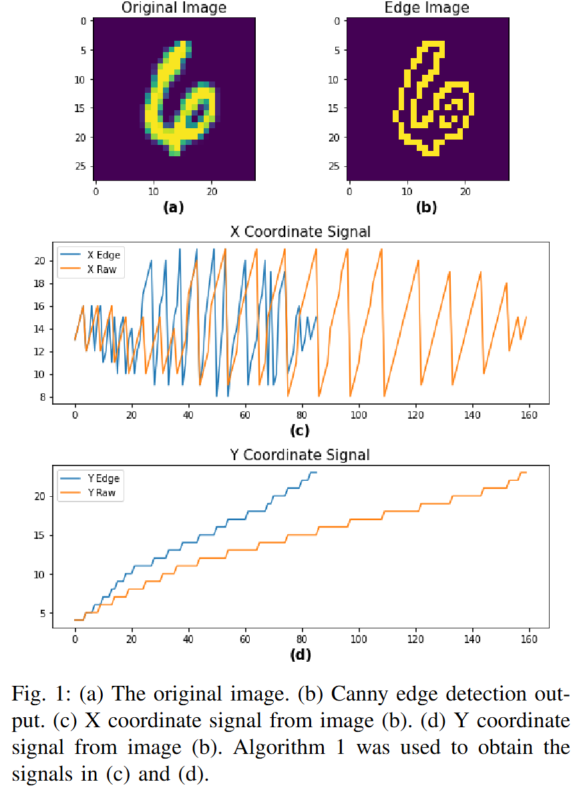
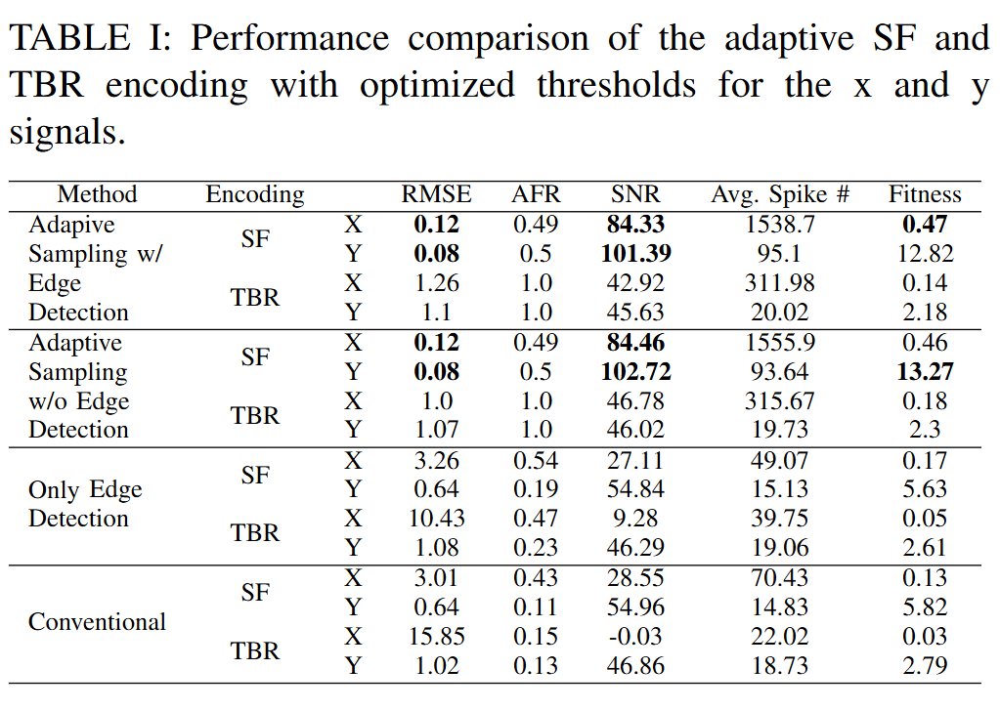

# An Adaptive Sampling and Edge Detection Approach for Encoding Static Images for Spiking Neural Networks

Code for the "An Adaptive Sampling and Edge Detection Approach for Encoding Static Images for Spiking Neural Networks" paper published in 2021 at the International Green and Sustainable Conference (IGSC).

Authors:

- [Peyton Chandarana](https://peytonsc.com/contact)
- Junlin Ou
- Ramtin Zand

# Abstract

Current state-of-the-art methods of image classification using convolutional neural networks are often constrained by both latency and power consumption. This places a limit on the devices, particularly low-power edge devices, that can employ these methods. Spiking neural networks (SNNs) are considered to be the third generation of artificial neural networks which aim to address these latency and power constraints by taking inspiration from biological neuronal communication processes. Before data such as images can be input into an SNN, however, they must be first encoded into spike trains. Herein, we propose a method for encoding static images into temporal spike trains using edge detection and an adaptive signal sampling method for use in SNNs. The edge detection process consists of first performing Canny edge detection on the 2D static images and then converting the edge detected images into two X and Y signals using an image-to-signal conversion method. The adaptive signaling approach consists of sampling the signals such that the signals maintain enough detail and are sensitive to abrupt changes in the signal. Temporal encoding mechanisms such as threshold-based representation (TBR) and step-forward (SF) are then able to be used to convert the sampled signals into spike trains. We use various error and indicator metrics to optimize and evaluate the efficiency and precision of the proposed image encoding approach. Comparison results between the original and reconstructed signals from spike trains generated using edge-detection and adaptive temporal encoding mechanism exhibit 18× and 7× reduction in average root mean square error (RMSE) compared to the conventional SF and TBR encoding, respectively, while used for encoding MNIST dataset.

# From the Paper





# Cite As

Available:

https://doi.org/10.1109/IGSC54211.2021.9651610

- Plaintext

```
P. Chandarana, J. Ou and R. Zand, "An Adaptive Sampling and Edge Detection Approach for Encoding Static Images for Spiking Neural Networks," 2021 12th International Green and Sustainable Computing Conference (IGSC), Pullman, WA, USA, 2021, pp. 1-8, doi: 10.1109/IGSC54211.2021.9651610. keywords: {Measurement;Image coding;Power demand;Image edge detection;Signal sampling;Encoding;Root mean square},
```

- BibTeX

```
@INPROCEEDINGS{9651610,
  author={Chandarana, Peyton and Ou, Junlin and Zand, Ramtin},
  booktitle={2021 12th International Green and Sustainable Computing Conference (IGSC)},
  title={An Adaptive Sampling and Edge Detection Approach for Encoding Static Images for Spiking Neural Networks},
  year={2021},
  volume={},
  number={},
  pages={1-8},
  keywords={Measurement;Image coding;Power demand;Image edge detection;Signal sampling;Encoding;Root mean square},
  doi={10.1109/IGSC54211.2021.9651610}}

```
